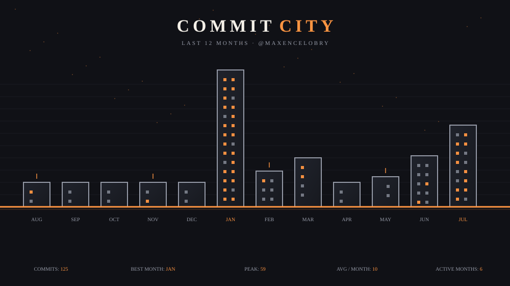

# Commit City

Turn a GitHub contribution history into a living pixel-art city.

<p align="center">
  
</p>

<p align="center">
  <a href="https://github.com/maxencelobry/commit-city"><strong>View source</strong></a>
  ·
  <a href="https://githubcity.blog/"><strong>Inspired by GitHub City</strong></a>
</p>

## Features

- 12-month contribution skyline with animated SVG output
- Complete, city + months, and city-only layouts
- Night/day themes, six accents and a mixed palette
- Public profile pages: `/u/<username>`
- Compact README badge: `/api/badge/<username>.svg`
- Contribution-based badges and shareable URLs
- Responsive vanilla frontend with no heavy UI framework

## Quick start

```sh
npm install
npm run dev
```

Open `http://localhost:3000`, enter a public GitHub username and generate a city.

Optional GitHub API token (`.env`, never commit it):

```env
GITHUB_TOKEN=github_pat_your_token_here
```

## Share

```md
[](https://your-domain.example/u/maxencelobry)
```

SVG options: `theme=night|day`, `color=lime|purple|blue|orange|pink|cyan|mix`, `view=full|months|city`.

## Inspiration

Inspired by [GitHub City](https://githubcity.blog/). Commit City explores the same playful idea through a lightweight 2D pixel skyline, animated SVGs and README-first sharing.

## Stack

Express · vanilla JavaScript · SVG · Node test runner

```sh
npm test
```

Part of a broader collection of small projects built to demonstrate practical product design and engineering work.
